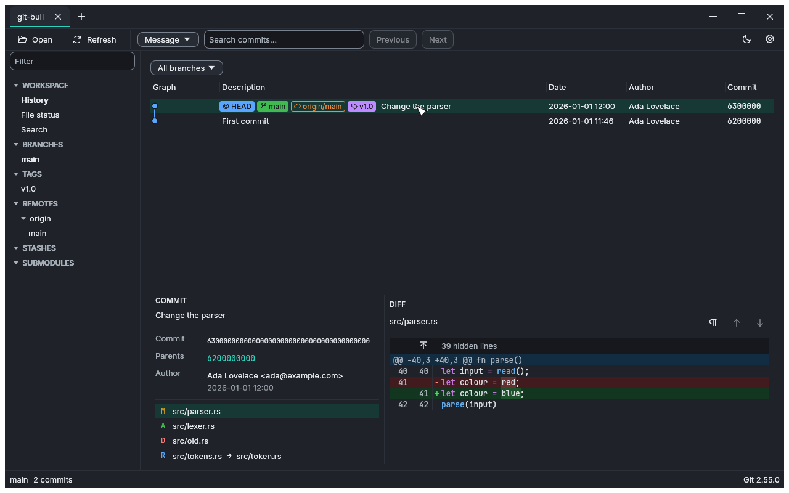
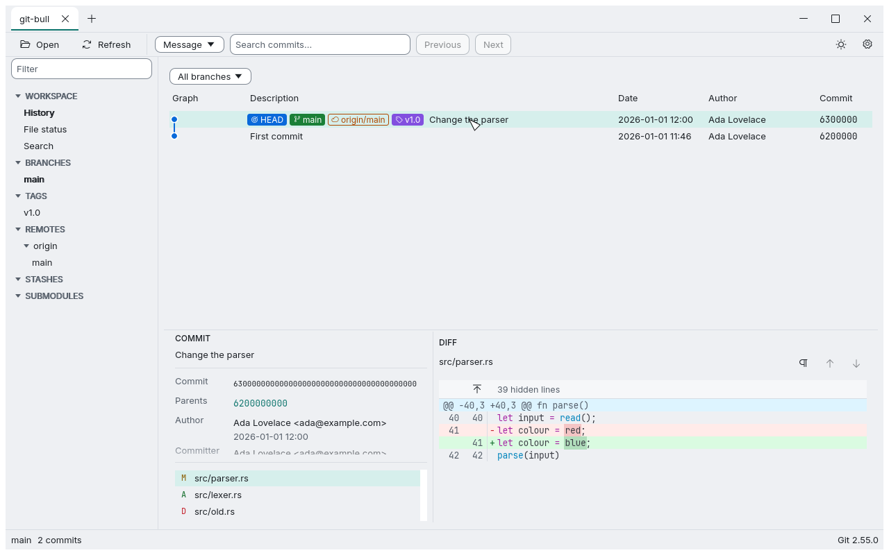
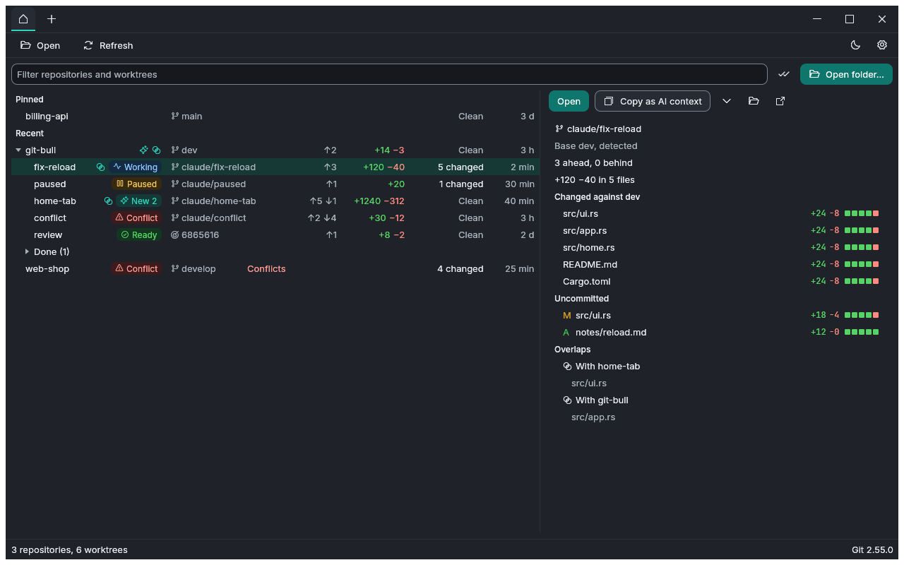
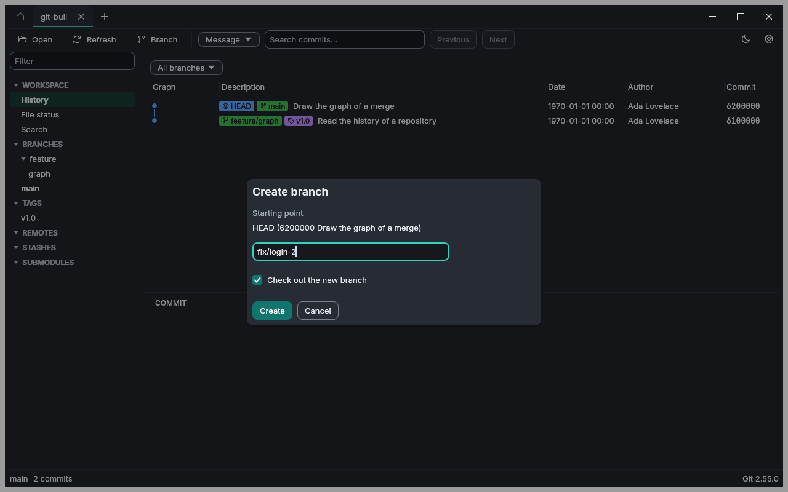
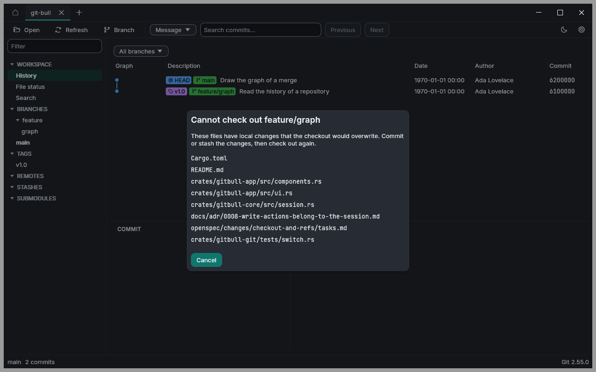

# git-bull

A fast, open-source Git client for Linux, Windows and macOS, written in Rust.
Its layout follows SourceTree: repository tabs, a sidebar with branches, tags,
remotes and stashes, a commit list with graph, and commit details with diffs
below. It is built to stay fluid on repositories with more than a million
commits.

git-bull is in early development. The current release, 0.2.0, holds the
viewer, the worktree cockpit of the home tab, and the first write actions:
it checks out branches, tags and commits and creates branches and tags; it
is on the releases page. The next development priority is the rest of the
local Git operations: staging and committing. The commit graph's
visual redesign is deferred with low priority. What git-bull does is
specified in [`openspec/specs`](openspec/specs), the changes being planned
or built are in [`openspec/changes`](openspec/changes), the architecture
decisions are in [`docs/adr`](docs/adr), and the next steps are in the
[roadmap overview](docs/roadmap.md) and on the
[GitHub roadmap](https://github.com/users/BlackmillSolutions/projects/1).

## Screenshots

The images are the snapshots that the tests of the interface compare, so
they show git-bull as it is, with the small repositories of the tests.

The history of a repository, with the details and the diff of a commit:



The same view in the light theme:



The home tab, with the worktrees of each repository, their states and the
detail panel of one of them:



Creating a branch, with the name checked while it is typed:



A checkout that would overwrite local changes is refused, and the files are
listed:



## Installation

### Supported systems

| Platform | Oldest supported system | Package |
|---|---|---|
| Windows x64 | Windows 10 | `git-bull-<version>-windows-x64.zip` |
| macOS, Apple silicon | macOS 12 | `git-bull-<version>-macos-arm64.zip` |
| macOS, Intel | macOS 12 | `git-bull-<version>-macos-x64.zip` |
| Linux x64 | Ubuntu 22.04, and distributions with the same or a newer C library (glibc 2.35) | `git-bull-<version>-linux-x64.AppImage` or `.tar.gz` |

The packages are on the [releases page](https://github.com/BlackmillSolutions/git-bull/releases).
Each contains both licence texts and `THIRD-PARTY-NOTICES.md`.

### Prerequisites

Every system needs **Git 2.34 or newer**. git-bull looks for `git` on the
`PATH`, and on Windows also in the folders where Git for Windows installs
it. When it finds none, or one that is too old, its start screen lets you
choose the Git executable.

| Platform | What to install |
|---|---|
| Windows | [Git for Windows](https://git-scm.com/download/win). Nothing else. |
| macOS | Git from the Xcode Command Line Tools: `xcode-select --install`. An application started from the Finder sees only `/usr/bin` and a few other system folders, so Git installed only through Homebrew (`/opt/homebrew/bin/git`) has to be chosen on the start screen. |
| Linux | Git, for example `sudo apt install git`. The folder dialog uses the XDG desktop portal: `xdg-desktop-portal` with a backend such as `xdg-desktop-portal-gnome`, `-gtk` or `-kde`; Ubuntu's desktop has them. Following the light or dark appearance of the desktop uses `gdbus` from `libglib2.0-bin`; without it git-bull starts dark. |

git-bull draws with Vulkan, Metal, DirectX 12 or OpenGL, whichever the system
offers; the graphics drivers that come with the systems above are enough.
It asks for the power-saving graphics adapter. On a computer with an
integrated and a dedicated adapter, such as many laptops, that is the
integrated one where the system lets an application choose. To draw with
the dedicated adapter instead, start git-bull with the environment variable
`WGPU_POWER_PREF=high`.

### Windows

1. Unpack the ZIP archive into a folder of your choice.
2. Start `git-bull.exe`.

The package has no developer signature. On the first start Windows may show
"Windows protected your PC": choose **More info**, then **Run anyway**. If
Windows blocks the file instead, open the properties of `git-bull.exe`, tick
**Unblock** and choose **OK**.

### macOS

1. Unpack the archive; this gives `git-bull.app`.
2. Move `git-bull.app` into the Applications folder.
3. Start it.

The package has no developer signature and is not notarised, so macOS
refuses the first start with a message that the developer cannot be
verified:

- On macOS 12 to 14, Control-click `git-bull.app` in the Finder, choose
  **Open**, and confirm **Open** in the dialog. Later starts need nothing
  further.
- On macOS 15 and newer, try to open it once, then open **System Settings >
  Privacy & Security**, choose **Open Anyway** next to the message about
  git-bull, and confirm.

Alternatively, remove the quarantine flag in a terminal:
`xattr -dr com.apple.quarantine /Applications/git-bull.app`.

### Linux

With the AppImage:

1. Make it executable: `chmod +x git-bull-<version>-linux-x64.AppImage`.
2. Start it: `./git-bull-<version>-linux-x64.AppImage`.

The AppImage mounts itself with FUSE through `fusermount3`, which Ubuntu's
desktop has (package `fuse3`); it does not need `libfuse2`. Where FUSE is
missing, start it with `--appimage-extract-and-run`.

With the `tar.gz` archive: unpack it and start `git-bull` inside.

Linux shows no warning about the missing signature.

## Building from source

### Prerequisites

- **Rust**, installed through [rustup](https://rustup.rs). The exact version
  is pinned in `rust-toolchain.toml`; rustup installs it on the first build.
- **A C linker for your platform:**
  - Windows: Visual Studio 2022 or its Build Tools with the workload
    "Desktop development with C++".
  - macOS: the Xcode Command Line Tools (`xcode-select --install`).
  - Linux: a C compiler such as `gcc`, for example from `build-essential` on
    Debian and Ubuntu.
- **Git 2.34 or newer** to run git-bull.

### Build and run

```sh
git clone https://github.com/BlackmillSolutions/git-bull.git
cd git-bull
cargo build --release
cargo run --release --bin git-bull
```

The binary is written to `target/release/git-bull` (`git-bull.exe` on
Windows).

### Checks

CI runs these checks for pull requests into `dev` or `master`, except for
planning-only branches under `plan/`:

```sh
cargo fmt --all --check
cargo clippy --workspace --all-targets --locked -- -D warnings
cargo test --workspace --locked
cargo deny check
```

`cargo deny` checks the licences of all dependencies and known security
advisories. Install it once with `cargo install cargo-deny --locked`.

### OpenSpec

The shared Claude Code and Codex workflows in `.claude/` and `.agents/`
are generated with **OpenSpec 1.13.2**. Use the same CLI version when
running `openspec init` or `openspec update`:

```sh
npm install --global @fission-ai/openspec@1.13.2
```

## Licence

git-bull is licensed under either of

- Apache License, Version 2.0 ([LICENSE-APACHE](LICENSE-APACHE))
- MIT licence ([LICENSE-MIT](LICENSE-MIT))

at your option.

Unless you explicitly state otherwise, any contribution intentionally
submitted for inclusion in git-bull by you, as defined in the Apache-2.0
licence, shall be dual licensed as above, without any additional terms or
conditions.
